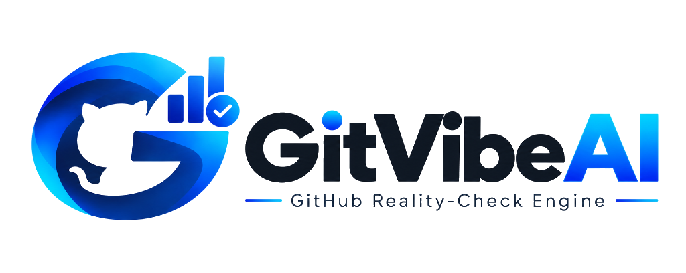
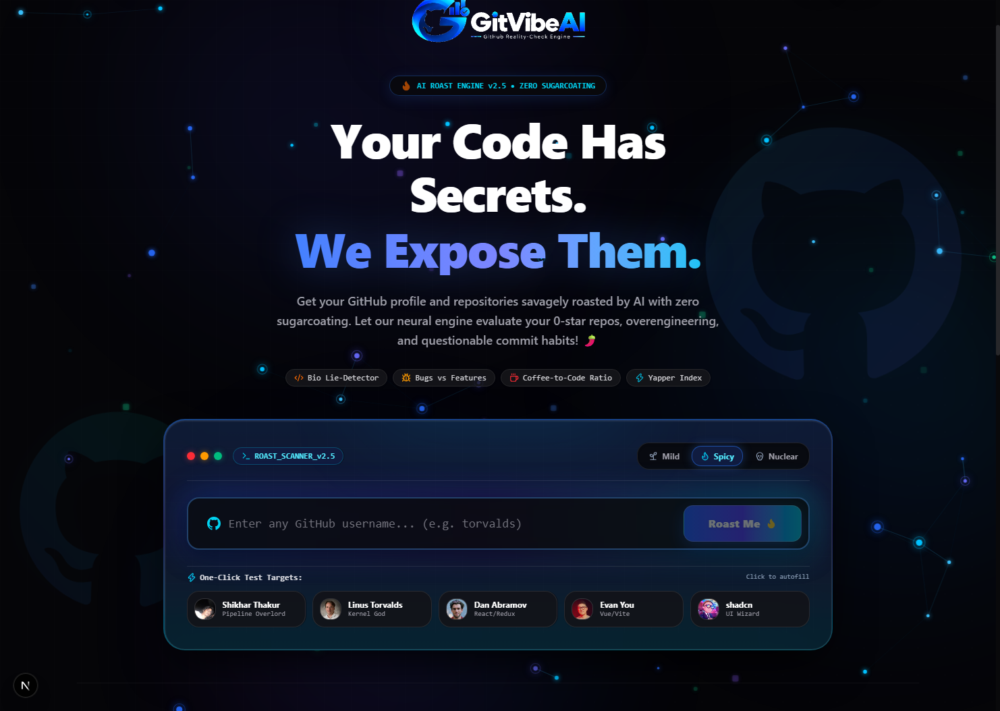
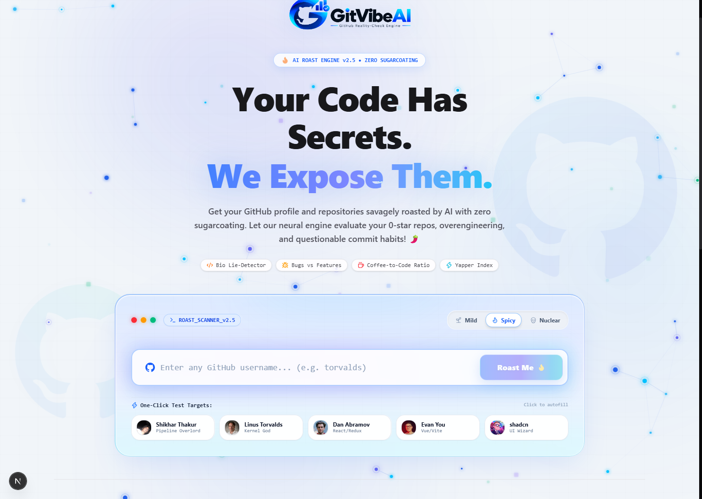
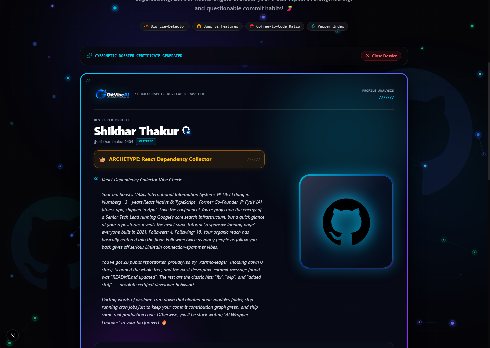
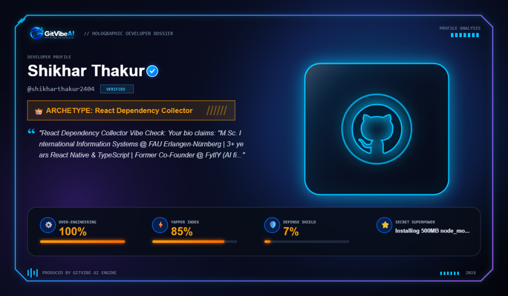
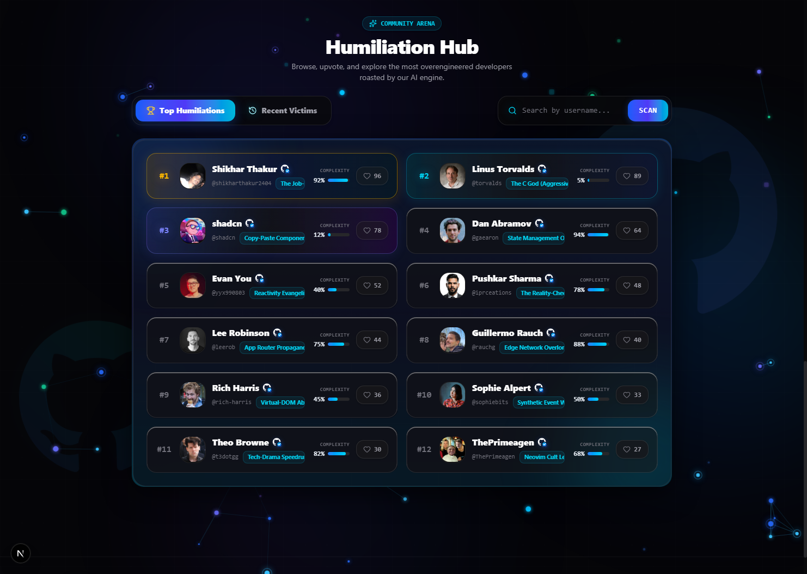

# ⚡ GITVIBE AI

### The Next-Gen Interactive AI GitHub Profile & Repo Roaster Engine

[](https://nextjs.org)
[](https://react.dev)
[](https://typescriptlang.org)
[](https://tailwindcss.com)
[](https://github.com/iprceations/GitVibeAI)
[](LICENSE)

<p align="center">
  <picture>
    <source media="(prefers-color-scheme: dark)" srcset="public/logo-dark.png">
    <source media="(prefers-color-scheme: light)" srcset="public/logo-light.png">
    
  </picture>
</p>

---

<p align="center">
  <strong>Crafted with precision by <a href="https://github.com/iprceations">Pushkar Sharma</a></strong>
</p>

<p align="center">
  <a href="#-screenshots--ui-walkthrough">Screenshots Walkthrough</a> •
  <a href="#-key-features">Key Features</a> •
  <a href="#%EF%B8%8F-tech-stack">Tech Stack</a> •
  <a href="#-getting-started">Getting Started</a> •
  <a href="#-project-structure">Project Structure</a> •
  <a href="#-deployment-on-vercel">Vercel Deployment</a>
</p>

---

## 🌟 Overview

**GitVibe AI** is a highly interactive, viral web platform that scans any GitHub username, analyzes their repositories, language distribution, commit frequencies, and bio patterns to generate a savage, context-aware developer archetype roast. Featuring adjustable spice levels (Mild, Spicy, Nuclear), synthesized Web Audio feedback, high-resolution PNG certificate export, and a global **Humiliation Hub** leaderboard, it is built with Next.js 15, React 19, and Tailwind CSS v4.

🔗 **Live Repository**: [github.com/iprceations/GitVibeAI](https://github.com/iprceations/GitVibeAI)

---

## 📸 Screenshots & UI Walkthrough

A complete step-by-step visual walkthrough of GitVibe AI across both Day and Night modes:

### 1️⃣ Step 1: The Roaster HUD (Night Mode)
> High-voltage cyber terminal with real-time particle network, quick test presets, and adjustable spice levels (*Mild, Spicy, Nuclear*).

<p align="center">
  
</p>

- **Cyber Terminal Header**: `ROAST_SCANNER_v2.5` with traffic-light status indicators.
- **Spice Intensity Selector**:
  - 🌱 **Mild**: Playful banter with constructive tech humor.
  - 🌶️ **Spicy (Default)**: Brutal developer realities, Hinglish memes, and ghost repo callouts.
  - 💀 **Nuclear**: Unfiltered existential dread, framework hopping, and commit habit takedowns.
- **One-Click Quick Targets**: Instant testing with preset chips for Linus Torvalds, Dan Abramov, Evan You, shadcn, and [@shikharthakur2404](https://github.com/shikharthakur2404) (*Shikhar Thakur*).

---

### 2️⃣ Step 2: Crisp Daylight Aesthetic (Day Mode)
> Modern, high-contrast light mode with sleek frosted-glass container styling and vibrant cyber accents.

<p align="center">
  
</p>

- **Instant Theme Toggle**: Seamless switch between Day and Night themes via the navbar Sun/Moon control.
- **Crystal-Clear Typography & Contrast**: Tailored dark slate lettering and luminous blue gradients optimized for daylight readability.
- **Synthesized Audio Feedback**: Custom Web Audio cues for theme switches, clicks, and roasts with instant mute controls.

---

### 3️⃣ Step 3: Holographic Developer Dossier & Roast Certificate
> In-depth reality check complete with developer archetype diagnosis, 3D Octocat plaque, and dev radar metrics.
> 
> 🎯 **Featured Victim:** [@shikharthakur2404](https://github.com/shikharthakur2404) (*Shikhar Thakur*) — Diagnosed Archetype: **`React Dependency Collector`** 👑

#### 🖥️ 3A. Live Web Application Dossier View:
<p align="center">
  
</p>

#### 🪪 3B. High-Resolution Downloadable Holographic Certificate Card:
<p align="center">
  
</p>

- **Verified GitHub Identity**: Custom GitHub octocat emblem with verified checkmark badge for [@shikharthakur2404](https://github.com/shikharthakur2404).
- **Developer Archetype Diagnosis**: Viral labels such as *React Dependency Collector*, *The LinkedIn Influencer*, *Spaghetti Code Architect*, *The C God*, or *Pipeline Overlord*.
- **Deep Reality-Check Roast**: Multi-paragraph witty critique analyzing repos, star counts, commit habits, and bio inflation (*"Your bio claims: M.Sc. International Information Systems..."*).
- **Cyber Radar Metrics**:
  - ⚙️ **Over-Engineering Score (100%)**
  - ⚡ **Yapper Index (85%)**
  - 🛡️ **Defense Shield Rating (7%)**
  - ⭐ **Secret Superpower Revelation**: *Installing 500MB node_modules in seconds*
- **One-Click Share & Export**: Instant high-res PNG download and direct share links to X (Twitter), LinkedIn, and WhatsApp.

---

### 4️⃣ Step 4: Humiliation Hub (Global Hall of Shame Leaderboard)
> Live searchable developer leaderboard showcasing the most overengineered profiles worldwide.

<p align="center">
  
</p>

- **Dynamic Live Search & Filters**: Instant username filtering and tab toggling between *Top Humiliations* and *Recent Victims*.
- **Rank Badges & Flame Counters**: Gold `#1` ([@shikharthakur2404](https://github.com/shikharthakur2404)), Cyan `#2`, Purple `#3` podium medals with interactive like/upvote buttons and confetti bursts.
- **Clean Responsive Pagination**: Fast page navigation with automatic persistence (PostgreSQL / In-Memory resilient fallback).

---

## 🔥 Key Features

- **AI Roast Engine**: Generates context-aware, witty developer roasts using Hinglish/English developer humor.
- **Adjustable Spice Levels**:
  - 🌱 **Mild**: Gentle, playful tease with constructive tech humor.
  - 🌶️ **Spicy (Default)**: Brutal developer truths, Hinglish memes, calling out 0-star repos.
  - 💀 **Nuclear**: Unfiltered existential crisis, framework obsession, and commit habit takedowns.
- **Quick Preset Developer Handles**: One-click test handles for Linus Torvalds, Dan Abramov, Evan You, shadcn, and Shikhar Thakur.
- **Developer Archetypes**: Assigns profiles like *Spaghetti Code Architect*, *Quiet Prodigy*, or *Commit Spammer*.
- **Interactive Stats**:
  - **Overengineering Score**
  - **Yapper Index** (Code-to-talk ratio)
  - **Bugs-to-Features Ratio**
  - **Coffee-to-Code Ratio**
  - **Defense Shield Level**
- **Instant Card Export**: Download your roast card as a high-resolution PNG image directly from your browser.
- **Web Audio Sound Effects**: Custom synthesized audio cues on roast generation, button clicks, and upvotes (with mute toggle).
- **Searchable Global Leaderboard**: The "Humiliation Hub" records roasts with live search/filter, sorted by likes and recent additions.
- **One-Click Social Sharing**: Share roast cards directly to Twitter/X, LinkedIn, and WhatsApp with pre-populated text and hashtags.
- **Zero-Config Resilient Database**: Automatically runs in-memory with pre-seeded developer icons if PostgreSQL is not configured.

---

## 🛠️ Tech Stack

- **Framework**: Next.js 15 (App Router)
- **Frontend**: React 19, Tailwind CSS v4, Framer Motion, Lucide Icons
- **AI Integrations**: AI SDK & Multi-Model Gateway (GPT-4o-Mini / Gemini 2.5 Flash) with resilient local fallback engine
- **Audio**: Web Audio API Sound Synthesizer
- **Database**: PostgreSQL (via node-postgres Pool) + Automatic In-Memory Fallback
- **Styling**: Class Variance Authority (CVA), Tailwind Merge

---

## 🚀 Getting Started

### Prerequisites

- Node.js (v18 or higher)
- pnpm / npm / yarn
- *(Optional)* A PostgreSQL Database (Neon or self-hosted)

### Installation & Local Setup

1. **Clone the Repository**:
   ```bash
   git clone https://github.com/iprceations/GitVibeAI.git
   cd GitVibeAI
   ```

2. **Install Dependencies**:
   ```bash
   pnpm install
   ```

3. **Configure Environment Variables (Optional)**:
   Create a `.env.local` file in the root directory:
   ```env
   # Optional: Database URL (if omitted, GitVibe AI runs seamlessly in-memory)
   DATABASE_URL="your-postgres-connection-string"

   # Optional: AI Gateway API Key
   AI_GATEWAY_API_KEY="your-ai-gateway-key"

   # Optional: GitHub token to increase API rate limits
   GITHUB_TOKEN="your-github-personal-access-token"
   ```

4. **Initialize Database Tables (If using PostgreSQL)**:
   ```bash
   node scripts/init-db.js
   ```

5. **Run the Development Server**:
   ```bash
   pnpm dev
   ```

Open [http://localhost:3000](http://localhost:3000) in your browser to see the roast engine in action.

---

## 🌐 Deployment on Vercel

GitVibe AI is fully configured for one-click deployment on [Vercel](https://vercel.com):

1. **Import the repository**: Link `https://github.com/iprceations/GitVibeAI` to your Vercel account.
2. **Framework Preset**: Next.js (automatically detected).
3. **Environment Variables** (Optional): Add `DATABASE_URL` (e.g. from Neon Postgres or Supabase) if you wish to persist leaderboard entries permanently. Otherwise, GitVibe AI automatically falls back to high-speed in-memory state.
4. **Deploy**: Click **Deploy** and your live site will be ready at `https://gitvibe-ai.vercel.app` (or your chosen URL).

---

## 📂 Project Structure

```
├── app/
│   ├── api/
│   │   ├── leaderboard/      # Leaderboard data fetching API
│   │   ├── like/             # Roast liking/voting handler
│   │   ├── recent/           # Recent roasts feed API
│   │   └── roast/            # GitHub stats fetcher & AI Roast generator
│   ├── layout.tsx            # Global layout, viewport & metadata
│   └── page.tsx              # Main interactive interface
├── components/
│   ├── BackgroundAnimation.tsx # Floating interactive cyber particles
│   ├── GitHubVerifiedBadge.tsx # Custom GitHub icon + verification tick
│   ├── Leaderboard.tsx       # Live "Humiliation Hub" leaderboard with search & pagination
│   ├── Navbar.tsx            # Theme toggle (Day/Night) & sound controls
│   ├── RoastForm.tsx         # GitHub username form, spice selector, and preset chips
│   └── RoastResult.tsx       # Holographic card, radar stats sliders, and PNG export
├── lib/
│   ├── db.ts                 # Dual-mode database client (Postgres + In-Memory)
│   └── sound.ts              # Web Audio synthesizer for UI sound effects
├── public/
│   ├── logo-light.png        # Pristine light theme logo (dark letters)
│   ├── logo-dark.png         # Solid dark theme logo (white letters)
│   ├── logo.png              # Universal default branding logo
│   └── screenshots/          # Walkthrough screenshots (Day, Night, Dossier, Hub)
└── scripts/
    └── init-db.js            # PostgreSQL table initialization script
```

---

## 📄 License

Distributed under the MIT License. See [LICENSE](LICENSE) for more information.

---

<p align="center">
  Developed with 💻 by <a href="https://github.com/iprceations">Pushkar Sharma</a>
</p>
